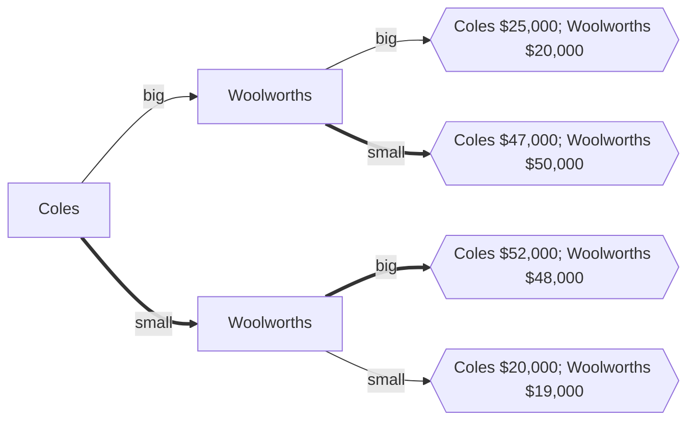

# Format testing page

Back to [[Playground]]

This is a page intended to test the rendering compatibility of markdown compilers and the styling of the result thereof. Note that syntax for the non-standard [[Obsidian]] markdown is included; some markdown code segments are copied from Obsidian Help.

If you see anything that look ugly, something is probably broken.

## Headings

```md
# Heading 1
## Heading 2
### Heading 3
#### Heading 4
##### Heading 5
###### Heading 6
```

# Heading 1
## Heading 2
### Heading 3
#### Heading 4
##### Heading 5
###### Heading 6

## Text decoration

```md
This is a normal paragraph

This is a looooong looooong looooong looooong looooong looooong looooong looooong looooong looooong looooong looooong looooong looooong looooong looooong looooong looooong looooong looooong looooong looooong looooong looooong looooong looooong looooong looooong looooong looooong looooong looooong looooong looooong looooong looooong looooong looooong looooong looooong looooong looooong looooong looooong looooong looooong looooong looooong paragraph

*italicised text* can be done with _asterisks xor underscores_

**bold text** can be done with __double asterisks xor double underscores_

***italicised bold text*** or ___more italicised bold text___ or ___italicised bold_ in bold__

~~*italicised text striked*~~

~~**bold text striked**~~

~~***italicised bold text striked***~~

==*italicised text highlighted*==

==**bold text highlighted**==

==***italicised bold text highlighted***==

~~==*italicised text highlighted striked*==~~

~~==**bold text highlighted striked**==~~

~~==***italicised bold text highlighted striked***==~~

The missing <u>underline text</u>

~~strikethrough~~

==highlighted text==

this is some `inline code`

this is some **`bold inline code`**

this is some _`italic inline code`_

this is some ***`bold italic inline code`***

Some crazy combinations ~~*==**`bold italic highlighted striked inline code`**==*~~

%%a comment in Obsidian%%
```

This is a normal paragraph

This is a looooong looooong looooong looooong looooong looooong looooong looooong looooong looooong looooong looooong looooong looooong looooong looooong looooong looooong looooong looooong looooong looooong looooong looooong looooong looooong looooong looooong looooong looooong looooong looooong looooong looooong looooong looooong looooong looooong looooong looooong looooong looooong looooong looooong looooong looooong looooong looooong paragraph

*italicised text* can be done with _asterisks xor underscores_

**bold text** can be done with __double asterisks xor double underscores_

***italicised bold text*** or ___more italicised bold text___ or ___italicised bold_ in bold__

~~*italicised text striked*~~

~~**bold text striked**~~

~~***italicised bold text striked***~~

==*italicised text highlighted*==

==**bold text highlighted**==

==***italicised bold text highlighted***==

~~==*italicised text highlighted striked*==~~

~~==**bold text highlighted striked**==~~

~~==***italicised bold text highlighted striked***==~~

The missing <u>underline text</u>

~~strikethrough~~

==highlighted text==

this is some `inline code`

this is some **`bold inline code`**

this is some _`italic inline code`_

this is some ***`bold italic inline code`***

Some crazy combinations ~~*==**`bold italic highlighted striked inline code`**==*~~

%%a comment in Obsidian%%

## Lists

```md
Bullet lists can be done by * - xor +

- item 1
- item 2
- item 3
+ item 1
+ item 2
+ item 3
* item 1
* item 2
* item 3

Numbered list by numbers

1. number 1
2. number 2
3. number 3

Nested lists of mixed style

1. First thing first
	- Sub point 1
	- Sub point 2
	- Sub point 3
2. Second thing but lower entropy
	1. Organised point 1
	2. Organised point 2
	3. Organised point 3
3. Other things nested in list
	- Paragraphs
		Lorem ipsum dolor sit amet consectetur adipisicing elit. Repellat odio similique hic laudantium molestiae nostrum atque explicabo? Eum aspernatur odit dolorem repellendus architecto quia fuga magnam aut autem sint maiores facere error ab saepe placeat illo doloremque voluptas, totam laborum dolore, voluptatibus harum. Voluptates placeat modi dicta consequatur tenetur eum!
		Eum aspernatur odit dolorem repellendus architecto quia fuga magnam aut autem sint maiores facere error ab saepe placeat illo doloremque voluptas, totam laborum dolore, voluptatibus harum. 
	- Table
		- | key   | value |
			| ----- | ----- |
			| alive | True  |
			| dead  | True  |
	- Image
	- Embed
		- <iframe width="400" height="300" src="https://embed.windy.com/embed2.html?lat=1.303&lon=103.857&detailLat=1.303&detailLon=103.857&width=650&height=450&zoom=5&level=surface&overlay=wind&product=ecmwf&menu=&message=&marker=&calendar=now&pressure=&type=map&location=coordinates&detail=&metricWind=default&metricTemp=default&radarRange=-1" frameborder="0"></iframe>


```

Bullet lists can be done by * - xor +

- item 1
- item 2
- item 3
+ item 1
+ item 2
+ item 3
* item 1
* item 2
* item 3

Numbered list by numbers

1. number 1
2. number 2
3. number 3

Nested lists of mixed style

1. First thing first
	- Sub point 1
	- Sub point 2
	- Sub point 3
2. Second thing but lower entropy
	1. Organised point 1
	2. Organised point 2
	3. Organised point 3
3. Other things nested in list
	- Paragraphs
		Lorem ipsum dolor sit amet consectetur adipisicing elit. Repellat odio similique hic laudantium molestiae nostrum atque explicabo? Eum aspernatur odit dolorem repellendus architecto quia fuga magnam aut autem sint maiores facere error ab saepe placeat illo doloremque voluptas, totam laborum dolore, voluptatibus harum. Voluptates placeat modi dicta consequatur tenetur eum!
		Eum aspernatur odit dolorem repellendus architecto quia fuga magnam aut autem sint maiores facere error ab saepe placeat illo doloremque voluptas, totam laborum dolore, voluptatibus harum. 
	- Table
		- | key   | value |
			| ----- | ----- |
			| alive | True  |
			| dead  | True  |
	- Image
	- Embed
		- <iframe width="400" height="300" src="https://embed.windy.com/embed2.html?lat=1.303&lon=103.857&detailLat=1.303&detailLon=103.857&width=650&height=450&zoom=5&level=surface&overlay=wind&product=ecmwf&menu=&message=&marker=&calendar=now&pressure=&type=map&location=coordinates&detail=&metricWind=default&metricTemp=default&radarRange=-1" frameborder="0"></iframe>


## Block quote

```md
> This is a one line quote

> Feed it into itself and
> > This is a **nested** quote
> > > *More* nesting
>
> Enough of that
```

> This is a one line quote

> Feed it into itself and
> > This is a **nested** quote
> > > *More* nesting
>
> Enough of that

## Block code

Plain text
```
Lorem ipsum dolor sit amet consectetur adipisicing elit. Repellat odio similique hic laudantium molestiae nostrum atque explicabo? Eum aspernatur odit dolorem repellendus architecto quia fuga magnam aut autem sint maiores facere error ab saepe placeat illo doloremque voluptas, totam laborum dolore, voluptatibus harum. Voluptates placeat modi dicta consequatur tenetur eum!
```

JavaScript
```javascript
const express = require("express");
const app = express();
const bodyParser = require("body-parser");
const MongoClient = require("mongodb").MongoClient;
const assert = require("assert");
const crypto = require("crypto");
const fs = require("fs");
const CronJob = require('cron').CronJob;
```

Python
```python
if question.type == "other":
    print("oh no")
    for i in range(question.difficulty):
        panic()
    while not solved(problem):
        brain.append("creativity")
        try:
            solve(problem)
        except: MentalBreakdown:
            break
```

## Math

```md
Inline math $\Delta G = -nFE$

Off-line math $$E=E°-\frac{R T}{n F} \ln Q$$
```

Inline math $\Delta G = -nFE$

Off-line math $$E=E°-\frac{R T}{n F} \ln Q$$

## HTML

```html
<div style="background-color: #ffaaaa">
	<p>lkajsdflkjaskldfj</p>
</div>

<input type="text">
<input type="number">
<input type="password">
```

<div style="background-color: #ffaaaa">
	<p>lkajsdflkjaskldfj</p>
</div>

<input type="text">
<input type="number">
<input type="password">

```html
<script>
	alert("js running")
</script>
<!--note that sometimes this is disabled for security reason-->
```

<script>
	alert("js running")
</script>
## Embeds

```md
<iframe width="650" height="450" src="https://embed.windy.com/embed2.html?lat=1.303&lon=103.857&detailLat=1.303&detailLon=103.857&width=650&height=450&zoom=5&level=surface&overlay=wind&product=ecmwf&menu=&message=&marker=&calendar=now&pressure=&type=map&location=coordinates&detail=&metricWind=default&metricTemp=default&radarRange=-1" frameborder="0"></iframe>

<iframe src="https://www.youtube.com/embed/NnTvZWp5Q7o"></iframe>
```

<iframe width="650" height="450" src="https://embed.windy.com/embed2.html?lat=1.303&lon=103.857&detailLat=1.303&detailLon=103.857&width=650&height=450&zoom=5&level=surface&overlay=wind&product=ecmwf&menu=&message=&marker=&calendar=now&pressure=&type=map&location=coordinates&detail=&metricWind=default&metricTemp=default&radarRange=-1" frameborder="0"></iframe>

<iframe src="https://www.youtube.com/embed/NnTvZWp5Q7o"></iframe>

## Dividers

```md
---

___

***

----

**************

<hr>
```

---

___

***

----

**************

<hr>

## Connecting (probably Obsidian only)

```md
Tags:: #sandbox #sandbox/anki 

Internal links to [[another page]]

Internal link to [[another page|another page but different name]]

Embed a page ![[Index]]

```

Tags:: #sandbox #sandbox/anki 

Internal links to [[another page]]

Internal link to [[another page|another page but different name]]

Embed a page ![[Index]]

## Images

```md
Standard markdown:


Standard markdown resized:


Obsidian image link:

![[Pasted image 20210216113916.png]]

Obsidian image link resized:

![[Pasted image 20210216113916.png|100]]

```

Standard markdown:


Standard markdown resized:


Obsidian image link:

![[Pasted image 20210216113916.png]]

Obsidian image link resized:

![[Pasted image 20210216113916.png|100]]

## Checklists

```md
- [x] #sandbox, [links](), **formatting** supported
- [x] list syntax required (any unordered or ordered list supported)
- [x] this is a complete item
- [ ] this is an incomplete item
- [ ] tasks can be clicked in Preview to be checked off
	- [ ] Nested list
	- [ ] another one
```

- [x] #sandbox, [links](), **formatting** supported
- [x] list syntax required (any unordered or ordered list supported)
- [x] this is a complete item
- [ ] this is an incomplete item
- [ ] tasks can be clicked in Preview to be checked off
	- [ ] Nested list
	- [ ] another one

## Mermaid diagram

<pre><code>	```mermaid
graph LR
	Coles--big-->Woolworths1[Woolworths]
	Coles==small==>Woolworths2[Woolworths]
	Woolworths1--big-->result1{{"Coles $25,000; Woolworths $20,000"}}
	Woolworths1==small==>result2{{"Coles $47,000; Woolworths $50,000"}}
	Woolworths2==big==>result3{{"Coles $52,000; Woolworths $48,000"}}
	Woolworths2--small-->result4{{"Coles $20,000; Woolworths $19,000"}}
```</code></pre>



## External Links

```md
This is probably the [most common one](https://www.google.com)

If this works there's auto link generation https://www.google.com

You can [reference this later]

You can [reference this later too but using the number][1]

[reference this later]: https://www.google.com
[1]: https://www.google.com

```

This is probably the [most common one](https://www.google.com)

If this works there's auto link generation https://www.google.com

You can [reference this later]

You can [reference this later too but using the number][1]

[reference this later]: https://www.google.com
[1]: https://www.google.com

## Tables

|                 | $\Delta H° < 0$         | $\Delta H° > 0$          |
| --------------- | ----------------------- | ------------------------ |
| $\Delta S° > 0$ | Spontaneous             | spontaneous at high temp |
| $\Delta S° < 0$ | Spontaneous at low temp | Not spontaneous          |

## Footnotes

Here's a simple footnote,[^1] and here's a longer one.[^bignote] and here's one done inline^[www.google.com]

[^1]: meaningful!

[^bignote]: Here's one with multiple paragraphs and code.

    Indent paragraphs to include them in the footnote.

    `{ my code }`

    Add as many paragraphs as you like.
## Table of contents and heading references

Internal 

- [[#Headings|Headings]]
- [[#Text decoration|Text decoration]]
- [[#Lists|Lists]]
- [[#Block quote|Block quote]]
- [[#Block code|Block code]]
- [[#Math|Math]]
- [[#HTML|HTML]]
- [[#Embeds|Embeds]]
- [[#Dividers|Dividers]]
- [[#Connecting (probably Obsidian only)|Connecting (probably Obsidian only)]]
- [[#Images|Images]]
- [[#Checklists|Checklists]]
- [[#Mermaid diagram|Mermaid diagram]]
- [[#External Links|External Links]]
- [[#Tables|Tables]]
- [[#Footnotes|Footnotes]]
- [[#Table of contents for internal linking|Table of contents for internal linking]]

Heading references in another file

[[Chemistry - Equilibrium#Ankification]]

## Drawing

![[Excalidraw/test drawing.excalidraw|400]]